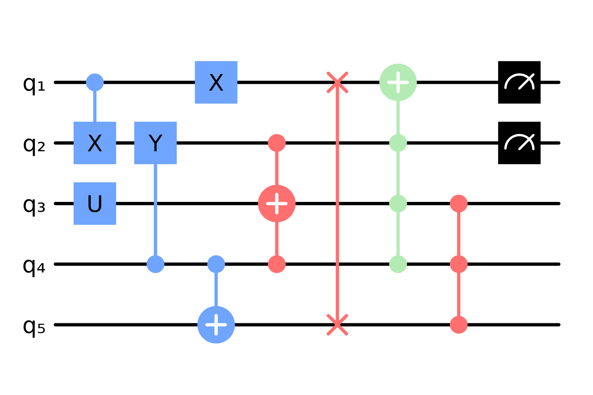

# QuantumCircuitDraw

[](https://github.com/nicolasloizeau/QuantumCircuitDraw.jl/actions/workflows/CI.yml?query=branch%3Amain)
[](https://nicolasloizeau.github.io/QuantumCircuitDraw.jl/dev)


Plot quantum circuits in Qiskit style.

# Installation
```julia
] add https://github.com/nicolasloizeau/QuantumCircuitDraw.jl.git
```

# Example
```julia

using Plots
using QuantumCircuitDraw

N = 5 # number of qubits
steps = 8 # number of steps in the circuit
circuit_plot(N, steps; grid=false) #initialize the plot

Single(1, 3, "U")
Single(3, 1, "X")
Controlled(1, 1, 2, "X")
CY(2, 4, 2)
CNOT(3, 4, 5)
CCNOT(4, 4, 2, 3)
Swap(5, 1, 5)
MCX(6, [2, 3, 4], 1)
MCZ(7, [5, 3, 4])
Measurement(8, 1)
Measurement(8, 2)
savefig("circuit.png")
savefig("circuit.svg")


```


